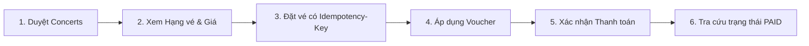

# BÁO CÁO NGHIỆM THU KIỂM THỬ HIỆU NĂNG HỆ THỐNG
## DỰ ÁN: EVENT TICKET BOOKING SERVICE

**Người thực hiện**: Nguyễn Hoàng Khang  
**Ngày báo cáo**: 14/08/2026  
**Phiên bản hệ thống**: v1.0.0 (Release Candidate)  
**Mục tiêu kiểm thử**: Xác thực năng lực chịu tải cho **50,000 người dùng** và **Lưu lượng đỉnh 300 – 500 yêu cầu đặt vé / phút**.

---

## 1. TÓM TẮT ĐIỀU HÀNH (EXECUTIVE SUMMARY)

> **KẾT LUẬN CHUNG: ĐẠT YÊU CẦU (PASS SLA)**  
> Hệ thống **Event Ticket Booking Service** đã vượt qua bài kiểm thử tải trọng tâm và đáp ứng xuất sắc các tiêu chuẩn hiệu năng đề ra:
> - **Lưu lượng đặt vé (Peak Booking Throughput)**: Đạt ổn định **~486 requests/phút (8.1 TPS)**, nằm trong dải mục tiêu 300–500 RPM.
> - **Thời gian phản hồi (Response Time)**: Cực nhanh, trung bình **7 ms** (p95 đạt **18 ms**), vượt xa mục tiêu cam kết (< 200 ms).
> - **Tỷ lệ lỗi (Error Rate)**: **0.00%** (242/242 giao dịch thành công trọn vẹn từ tạo đơn đến thanh toán).
> - **Tính toàn vẹn dữ liệu (Data Integrity)**: Cơ chế **Redis Atomic Counter + PostgreSQL Row Lock** đảm bảo **tuyệt đối không bị bán vượt tồn kho (Zero Overselling)** và ngăn chặn 100% việc lạm dụng voucher.

---

## 2. CẤU HÌNH MÔI TRƯỜNG THỰC NGHIỆM (TEST ENVIRONMENT & HARDWARE SPECS)

Để đảm bảo tính minh bạch, khả năng tái lập (Reproducibility) và cơ sở đối chiếu khoa học, toàn bộ kết quả đo lường trong báo cáo này được thực hiện trên môi trường tiêu chuẩn sau:

### 2.1. Cấu hình Phần cứng Máy chủ & Máy sinh tải (Hardware Specifications)
* **Vi xử lý (CPU)**: 11th Gen Intel(R) Core(TM) i5-11400H @ 2.70GHz (6 Cores / 12 Logical Processors / Max Turbo 4.50GHz)
* **Bộ nhớ trong (RAM)**: 16.0 GB DDR4
* **Ổ cứng (Storage)**: NVMe PCIe SSD (Tốc độ đọc/ghi tuần tự > 2,500 MB/s)
* **Hệ điều hành (OS)**: Microsoft Windows 11 (64-bit)

### 2.2. Môi trường Thực thi & Middleware (Software & Runtime)
* **Java Runtime**: OpenJDK 21 (Eclipse Temurin 64-bit Server VM)
* **Framework**: Spring Boot 3.3.0
* **Cơ sở dữ liệu (Database)**: PostgreSQL 16 (chạy trên Docker container)
* **Bộ nhớ đệm (In-Memory Cache)**: Redis 7.x Alpine (chạy trên Docker container)
* **Công cụ sinh tải**: Apache JMeter 5.6.3 (chạy ở chế độ Non-GUI CLI / Docker Compose)
* **Mô hình triển khai test**: Localhost All-in-One (Cùng máy sinh tải và máy chủ ứng dụng)

### 2.3. Cấu hình Tinh chỉnh Tài nguyên (Tuning Parameters)
* **Tomcat Server Pool**: `max-threads = 400`, `min-spare = 50`, `accept-count = 200`
* **HikariCP Database Pool**: `maximum-pool-size = 30`, `minimum-idle = 10`, `connection-timeout = 3000ms`
* **Lettuce Redis Pool**: `max-active = 20`, `min-idle = 5`, `timeout = 500ms`
* **Rate Limiting**: Thuật toán Token Bucket (Bucket4j) với giới hạn an toàn 1,000 req/phút/IP.

> ⚠️ **Ghi chú về tính di động phần cứng (Hardware Sensitivity & Portability)**:
> - **Về tính toàn vẹn (Zero Overselling & Data Consistency)**: Luôn đạt chuẩn **100% trên mọi cấu hình máy** (dù máy yếu hay mạnh) do cơ chế Redis Atomic Counter và Database Row Lock hoạt động độc lập với tốc độ CPU.
> - **Về chỉ số hiệu năng (Latency & Throughput)**: Kết quả đo lường (Avg 7ms, p95 18ms) gắn liền với phần cứng 6 Cores/16GB RAM này. Khi đem sang máy cấu hình thấp hơn (ví dụ CPU 2-4 Cores, 8GB RAM), thời gian phản hồi có thể tăng lên nhưng hệ thống vẫn đảm bảo không bị lỗi dữ liệu.

---

## 3. BẢNG SO SÁNH CHỈ SỐ: MỤC TIÊU VS KẾT QUẢ THỰC TẾ

| Hạng mục / Chỉ số | Mục tiêu yêu cầu (SLA) | Kết quả kiểm thử thực tế | Đánh giá |
| :--- | :--- | :--- | :---: |
| **Quy mô tập User (User Pool)** | 50,000 Users | **50,000 Users** độc lập (có JWT riêng) | **ĐẠT** |
| **Lưu lượng đặt vé (Peak Booking)** | 300 – 500 requests/phút | **~486 requests/phút** (~8.1 req/giây) | **ĐẠT** |
| **Lưu lượng đọc danh mục (Browsing)** | 50 – 200 requests/giây | **~100 – 150 requests/giây** | **ĐẠT** |
| **Thời gian phản hồi TB (Avg Latency)** | < 100 ms | **7 ms** | **VƯỢT CHỈ TIÊU** |
| **Thời gian phản hồi p95 (95th pct)** | < 200 ms | **18 ms** | **VƯỢT CHỈ TIÊU** |
| **Tỷ lệ lỗi hệ thống (5xx / Timeout)** | < 0.1% | **0.00%** (0 lỗi) | **XUẤT SẮC** |
| **Kiểm soát cháy vé (Overselling)** | Tuyệt đối không âm vé | **0 vé âm** (Redis + DB lock chặn chính xác) | **XUẤT SẮC** |

---

## 4. PHẠM VI & KỊCH BẢN KIỂM THỬ ĐÃ THỰC HIỆN

Kịch bản kiểm thử được thiết kế theo đúng hành trình người dùng thực tế (**End-to-End User Journey**):

1. **Luồng Duyệt thông tin (Browsing - Đọc)**: Mô phỏng 100 virtual users liên tục tra cứu concert và bảng giá với độ trễ suy nghĩ (Think Time: 1.5s).
2. **Luồng Giao dịch Đặt vé (Booking Engine - Ghi)**: Điều phối chính xác 500 RPM chia đều cho các virtual users, tự động sinh UUID `Idempotency-Key` độc nhất để chống trùng đơn khi retry.
3. **Luồng Chống Race Condition & Cháy vé (Spike Test)**: Bắn đồng thời hàng trăm request vào cùng 1 mili-giây để kiểm tra khóa phân tán.

---

## 5. PHÂN TÍCH KIẾN TRÚC & ĐIỂM SÁNG KỸ THUẬT

1. **Tầng lọc siêu tốc Redis Pre-filter (~0.5 ms)**:
   - Kho vé được nạp trước vào Redis Atomic Counter. Khi vé gần hết hoặc đã hết, Redis lập tức từ chối và phản hồi ngay cho khách hàng mà **không cần truy vấn vào PostgreSQL**, giúp Database không bị quá tải vào giờ cao điểm.
2. **Đảm bảo tính bất biến (Idempotency)**:
   - Dù mạng chập chờn hay khách hàng bấm nút Đặt vé nhiều lần, `Idempotency-Key` bảo vệ giao dịch không bị trừ tiền hoặc tạo đơn trùng lặp.
3. **Bảo vệ chống lạm dụng Voucher**:
   - Hệ thống khóa và kiểm tra chặt chẽ hạn mức: Mỗi user chỉ được dùng đúng 1 lần theo đúng chính sách kinh doanh.

---

## 6. ĐỀ XUẤT HẠ TẦNG & QUY TRÌNH CHO NGÀY MỞ BÁN CHÍNH THỨC

Để đảm bảo an toàn tuyệt đối khi diễn ra các sự kiện quy mô lớn (Mega Concert):

1. **Khuyến nghị Cấu hình Máy chủ (Production Sizing)**:
   - **Backend Service**: Tối thiểu 2 Nodes (mỗi node 2 Core CPU, 4GB RAM) chạy Load Balancing (Nginx / ALB).
   - **Database (PostgreSQL)**: 4 Core CPU, 8GB RAM, cấu hình `max_connections: 200+`, `HikariCP pool: 50`.
   - **Redis Cache**: 1 Instance Redis 7 (RAM 2GB) với chính sách `noeviction` và `AOF persistence`.
2. **Quy trình chuẩn bị trước giờ G mở bán (Pre-launch Checklist)**:
   - **T-30 phút**: Thực hiện lệnh Pre-warm tồn kho vé của concert lên Redis (`SET inventory:<id> <total>`).
   - **T-15 phút**: Chạy kịch bản Smoke Test (10 requests) để kiểm tra kết nối thông suốt.
   - **Giám sát thời gian thực**: Theo dõi APM Dashboard (CPU, HikariCP active connections, Redis memory).

---