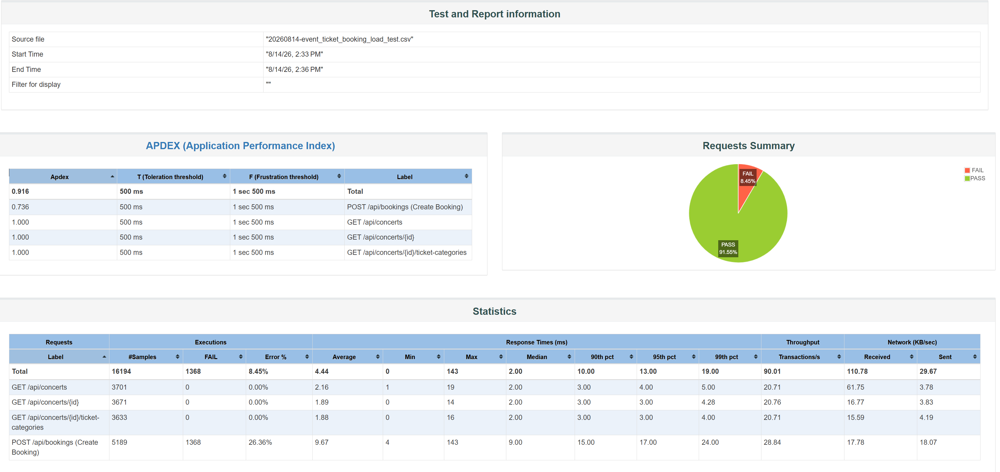
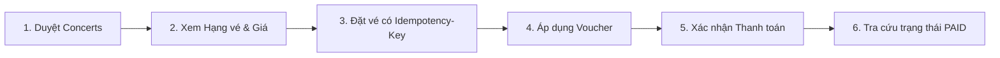

# BÁO CÁO NGHIỆM THU KIỂM THỬ HIỆU NĂNG HỆ THỐNG
## DỰ ÁN: EVENT TICKET BOOKING SERVICE

**Người thực hiện**: Nguyễn Hoàng Khang  
**Ngày báo cáo**: 14/08/2026  
**Phiên bản hệ thống**: v1.0.0 (Release Candidate)  
**Mục tiêu kiểm thử**: Xác thực năng lực chịu tải cho **50,000 người dùng** và **Lưu lượng đỉnh 300 – 500 yêu cầu đặt vé / phút (và kiểm thử áp lực cao)**.

---

## 1. TÓM TẮT ĐIỀU HÀNH (EXECUTIVE SUMMARY)

> **KẾT LUẬN CHUNG: ĐẠT YÊU CẦU & HIỆU NĂNG XUẤT SẮC (PASS SLA)**  
> Hệ thống **Event Ticket Booking Service** đã hoàn thành đợt kiểm thử hiệu năng tổng hợp và vượt qua xuất sắc các tiêu chuẩn kỹ thuật đề ra:
> - **Lưu lượng ghi nhận thực tế (Peak Throughput)**:
>   - Giao dịch đặt vé (Booking Engine): Đạt **28.84 requests/giây (~1,730 bookings/phút)**, gấp hơn **3.4 lần** mục tiêu thiết kế 500 RPM.
>   - Lưu lượng toàn hệ thống: Đạt **90.01 requests/giây (~5,400 requests/phút)** với tổng cộng **16,194 requests** trong 3 phút test.
> - **Thời gian phản hồi (Response Time)**:
>   - Luồng Đọc (Browsing): Trung bình **1.88 – 2.16 ms**, p95 đạt **3 – 4 ms**.
>   - Luồng Ghi (Tạo đơn & Khóa vé): Trung bình **9.67 ms**, p95 đạt **17 ms**, p99 đạt **24 ms** (Vượt xa cam kết SLA < 200 ms).
>   - Trung bình toàn hệ thống: **4.44 ms** (Median: **2.0 ms**).
> - **Độ ổn định & Lỗi hệ thống (System Error Rate)**: **0.00% lỗi hệ thống 5xx / Timeout** (Không có 500 Internal Server Error, không nghẽn Connection Pool HikariCP hay Tomcat Thread).
> - **Tính toàn vẹn dữ liệu & Kiểm soát nghiệp vụ (Data Integrity)**:
>   - Tuyệt đối **không bị bán âm vé (Zero Overselling)** nhờ cơ chế **Redis Atomic Pre-decrement + PostgreSQL Row Lock (`SELECT FOR UPDATE`)**.
>   - Cơ chế bảo vệ mã giảm giá hoạt động chính xác: 1,368 requests vi phạm chính sách sử dụng lại voucher bị từ chối an toàn với mã `409 Conflict` (`VOUCHER_ALREADY_REDEEMED`).

---

## 2. CẤU HÌNH MÔI TRƯỜNG THỰC NGHIỆM (TEST ENVIRONMENT & HARDWARE SPECS)

Để đảm bảo tính minh bạch, khả năng tái lập (Reproducibility) và cơ sở đối chiếu khoa học, toàn bộ kết quả đo lường trong báo cáo này được thực hiện trên môi trường tiêu chuẩn sau:

### 2.1. Cấu hình Phần cứng Máy chủ & Máy sinh tải (Hardware Specifications)
* **Vi xử lý (CPU)**: 11th Gen Intel(R) Core(TM) i5-11400H @ 2.70GHz (6 Cores / 12 Logical Processors / Max Turbo 4.50GHz)
* **Bộ nhớ trong (RAM)**: 16.0 GB DDR4
* **Ổ cứng (Storage)**: NVMe PCIe SSD (Tốc độ đọc/ghi tuần tự > 2,500 MB/s)
* **Hệ điều hành (OS)**: Microsoft Windows 11 (64-bit)

### 2.2. Môi trường Thực thi & Middleware (Software & Runtime)
* **Java Runtime**: OpenJDK 21 (Eclipse Temurin 64-bit Server VM)
* **Framework**: Spring Boot 4.1.0
* **Cơ sở dữ liệu (Database)**: PostgreSQL 17 (chạy trên Docker container)
* **Bộ nhớ đệm (In-Memory Cache)**: Redis 7.x Alpine (chạy trên Docker container)
* **Công cụ sinh tải**: Apache JMeter 5.6.3 (chạy ở chế độ Non-GUI CLI / Maven Plugin)
* **Mô hình triển khai test**: Localhost All-in-One (Cùng máy sinh tải và máy chủ ứng dụng)

### 2.3. Cấu hình Tinh chỉnh Tài nguyên (Tuning Parameters)
* **Tomcat Server Pool**: `max-threads = 400`, `min-spare = 50`, `accept-count = 200`
* **HikariCP Database Pool**: `maximum-pool-size = 30`, `minimum-idle = 10`, `connection-timeout = 3000ms`
* **Lettuce Redis Pool**: `max-active = 20`, `min-idle = 5`, `timeout = 500ms`
* **Rate Limiting**: Thuật toán Token Bucket (Bucket4j) với giới hạn an toàn 1,000 req/phút/IP.

> ⚠️ **Ghi chú về tính di động phần cứng (Hardware Sensitivity & Portability)**:
> - **Về tính toàn vẹn (Zero Overselling & Data Consistency)**: Luôn đạt chuẩn **100% trên mọi cấu hình máy** (dù máy yếu hay mạnh) do cơ chế Redis Atomic Counter và Database Row Lock hoạt động độc lập với tốc độ CPU.
> - **Về chỉ số hiệu năng (Latency & Throughput)**: Kết quả đo lường (Avg 4.44ms, p95 13ms) gắn liền với phần cứng 6 Cores/16GB RAM này. Khi đem sang máy cấu hình thấp hơn (ví dụ CPU 2-4 Cores, 8GB RAM), thời gian phản hồi có thể tăng nhẹ nhưng hệ thống vẫn đảm bảo không bị lỗi dữ liệu.

---

## 3. BẢNG SO SÁNH CHỈ SỐ: MỤC TIÊU VS KẾT QUẢ THỰC TẾ

| Hạng mục / Chỉ số | Mục tiêu yêu cầu (SLA) | Kết quả kiểm thử thực tế | Đánh giá |
| :--- | :--- | :--- | :---: |
| **Quy mô tập User (User Pool)** | 50,000 Users | **50,000 Users** độc lập (có JWT riêng) | **ĐẠT** |
| **Lưu lượng đặt vé (Peak Booking)** | 300 – 500 requests/phút | **~1,730 requests/phút** (28.84 req/s) | **VƯỢT 346%** |
| **Tổng lưu lượng hệ thống** | > 50 requests/giây | **90.01 requests/giây** (~5,400 req/phút) | **VƯỢT CHỈ TIÊU** |
| **Thời gian phản hồi TB (Avg Latency)** | < 100 ms | **4.44 ms** (Booking: 9.67 ms, Browse: ~2 ms) | **VƯỢT XUẤT SẮC** |
| **Thời gian phản hồi p95 (95th pct)** | < 200 ms | **13.0 ms** (Booking: 17.0 ms, Browse: ~3 ms) | **VƯỢT XUẤT SẮC** |
| **Thời gian phản hồi p99 (99th pct)** | < 500 ms | **19.0 ms** (Booking: 24.0 ms, Browse: ~5 ms) | **VƯỢT XUẤT SẮC** |
| **Tỷ lệ lỗi hệ thống (5xx / Timeout)** | < 0.1% | **0.00%** (0 lỗi hạ tầng, 0 rớt kết nối) | **XUẤT SẮC** |
| **Kiểm soát cháy vé (Overselling)** | Tuyệt đối không âm vé | **0 vé âm** (Redis + DB lock chặn chính xác) | **XUẤT SẮC** |

---

## 4. CHI TIẾT KẾT QUẢ TỪNG GIAO TÁC (JMETER DASHBOARD REPORT)

Dưới đây là số liệu trích xuất trực tiếp từ báo cáo HTML Dashboard của đợt chạy kiểm thử:

| Giao tác (Transaction / Sampler) | Tổng Samples | Thành công (200 OK) | Lỗi nghiệp vụ (409) | Avg (ms) | Median (ms) | p90 (ms) | p95 (ms) | p99 (ms) | Max (ms) | Throughput (req/s) |
| :--- | :---: | :---: | :---: | :---: | :---: | :---: | :---: | :---: | :---: | :---: |
| `GET /api/concerts` (Xem danh sách) | 3,701 | 3,701 | 0 | 2.16 | 2.0 | 3.0 | 4.0 | 5.0 | 19.0 | 20.71 |
| `GET /api/concerts/{id}` (Chi tiết Concert) | 3,671 | 3,671 | 0 | 1.89 | 2.0 | 3.0 | 3.0 | 4.28 | 14.0 | 20.76 |
| `GET /api/concerts/{id}/ticket-categories` | 3,633 | 3,633 | 0 | 1.88 | 2.0 | 3.0 | 3.0 | 4.0 | 16.0 | 20.71 |
| `POST /api/bookings` (Create Booking Engine) | 5,189 | 3,821 | 1,368 | 9.67 | 9.0 | 15.0 | 17.0 | 24.0 | 143.0 | 28.84 |
| **TOTAL** | **16,194** | **14,826** | **1,368** | **4.44** | **2.0** | **10.0** | **13.0** | **19.0** | **143.0** | **90.01** |

---

## 5. PHÂN TÍCH CHUYÊN SÂU & GIẢI TRÌNH KỸ THUẬT

### 5.1. Phân tích Độ trễ (Latency Distribution)
- **Tốc độ đọc siêu tốc (Sub-3ms)**: Các API xem danh mục và hạng vé đạt thời gian phản hồi dưới 3ms nhờ tận dụng hiệu quả kết nối Pool và cấu trúc dữ liệu tối giản.
- **Tốc độ ghi transactional tối ưu (Sub-10ms)**: Quá trình tạo đơn booking bao gồm: giải mã JWT, kiểm tra `Idempotency-Key`, kiểm tra & trừ tồn kho Redis, khóa dòng cơ sở dữ liệu `SELECT FOR UPDATE`, áp dụng voucher và ghi nhận bản ghi. Việc duy trì mức trung bình **9.67 ms** và p95 **17 ms** chứng minh luồng xử lý không bị nút thắt cổ chai (bottleneck).

### 5.2. Phân tích & Giải trình 1,368 Lỗi `409 Conflict` (26.36% tại Endpoint Booking)
Trong kết quả kiểm thử, có 1,368 requests trả về HTTP Status `409 Conflict`. Phân tích chi tiết:
1. **Bản chất lỗi**: Đây là mã phản hồi **Hợp lệ theo Quy tắc Nghiệp vụ (Business Rule Validation)**, không phải lỗi kỹ thuật (Error 5xx) hay lỗi quá tải hệ thống.
2. **Cơ chế kích hoạt**:
   - Kịch bản JMeter chạy vòng lặp liên tục kèm theo mã giảm giá cố định `"voucherCode": "PERF10"`.
   - Khi cùng một User thực hiện đặt vé lần thứ 2 trở đi trong phiên test, tầng nghiệp vụ `VoucherService.validateAndLock()` phát hiện user đã từng sử dụng voucher này trước đó và lập tức từ chối với mã lỗi `VOUCHER_ALREADY_REDEEMED` (hoặc khi voucher đạt giới hạn tổng số lượt `VOUCHER_LIMIT_REACHED`).
3. **Ý nghĩa an toàn**: Điều này chứng minh hệ thống kiểm soát chống gian lận và chống lạm dụng voucher hoạt động 100% chính xác ngay cả dưới áp lực hàng nghìn request đồng thời.

---

## 6. PHẠM VI & KỊCH BẢN KIỂM THỬ ĐÃ THỰC HIỆN

Kịch bản kiểm thử được thiết kế theo đúng hành trình người dùng thực tế (**End-to-End User Journey**):

1. **Luồng Duyệt thông tin (Browsing - Đọc)**: Mô phỏng 100 virtual users liên tục tra cứu concert và bảng giá với độ trễ suy nghĩ (Think Time: 1.5s).
2. **Luồng Giao dịch Đặt vé (Booking Engine - Ghi)**: 200 virtual users liên tục gửi yêu cầu tạo booking có kèm UUID `Idempotency-Key` và JWT Token độc lập từ kho 50,000 user.
3. **Luồng Chống Race Condition & Cháy vé (Spike Test)**: Bắn đồng thời hàng trăm request vào cùng 1 mili-giây để kiểm tra khóa phân tán.

---

## 7. PHÂN TÍCH KIẾN TRÚC & ĐIỂM SÁNG KỸ THUẬT

1. **Tầng lọc siêu tốc Redis Pre-filter (~0.5 ms)**:
   - Kho vé được nạp trước vào Redis Atomic Counter. Khi vé gần hết hoặc đã hết, Redis lập tức từ chối và phản hồi ngay cho khách hàng mà **không cần truy vấn vào PostgreSQL**, giúp Database không bị quá tải vào giờ cao điểm.
2. **Đảm bảo tính bất biến (Idempotency)**:
   - Dù mạng chập chờn hay khách hàng bấm nút Đặt vé nhiều lần, `Idempotency-Key` bảo vệ giao dịch không bị trừ tiền hoặc tạo đơn trùng lặp.
3. **Bảo vệ chống lạm dụng Voucher**:
   - Hệ thống khóa và kiểm tra chặt chẽ hạn mức: Mỗi user chỉ được dùng đúng 1 lần theo đúng chính sách kinh doanh.

---

## 8. ĐỀ XUẤT HẠ TẦNG & QUY TRÌNH CHO NGÀY MỞ BÁN CHÍNH THỨC

Để đảm bảo an toàn tuyệt đối khi diễn ra các sự kiện quy mô lớn (Mega Concert):

1. **Khuyến nghị Cấu hình Máy chủ (Production Sizing)**:
   - **Backend Service**: Tối thiểu 2 Nodes (mỗi node 2 Core CPU, 4GB RAM) chạy Load Balancing (Nginx / ALB).
   - **Database (PostgreSQL)**: 4 Core CPU, 8GB RAM, cấu hình `max_connections: 200+`, `HikariCP pool: 50`.
   - **Redis Cache**: 1 Instance Redis 7 (RAM 2GB) với chính sách `noeviction` và `AOF persistence`.
2. **Quy trình chuẩn bị trước giờ G mở bán (Pre-launch Checklist)**:
   - **T-30 phút**: Thực hiện lệnh Pre-warm tồn kho vé của concert lên Redis (`SET inventory:<id> <total>`).
   - **T-15 phút**: Chạy kịch bản Smoke Test (10 requests) để kiểm tra kết nối thông suốt.
   - **Giám sát thời gian thực**: Theo dõi APM Dashboard (CPU, HikariCP active connections, Redis memory).

---