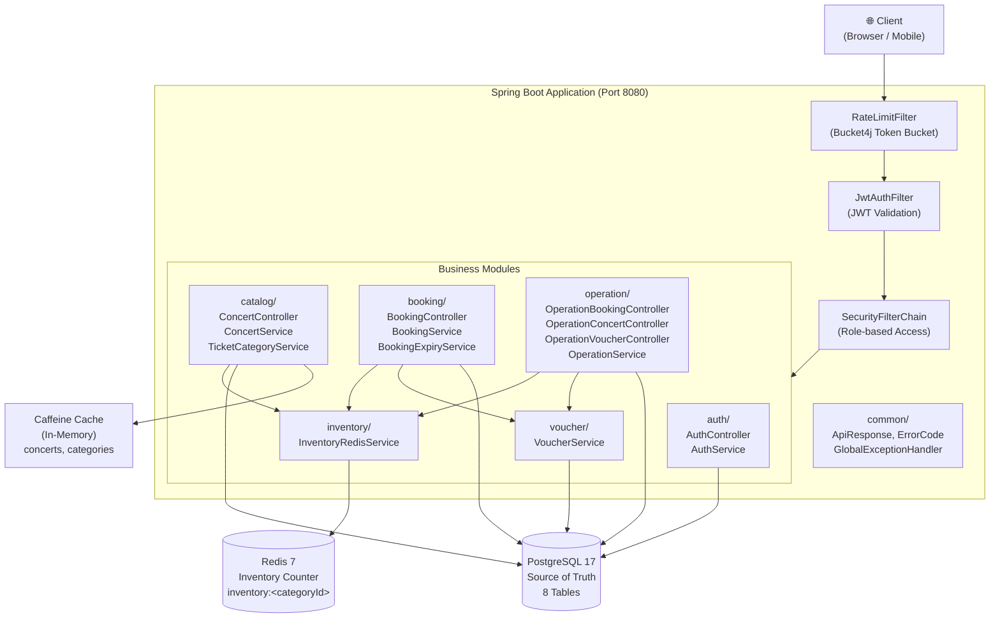
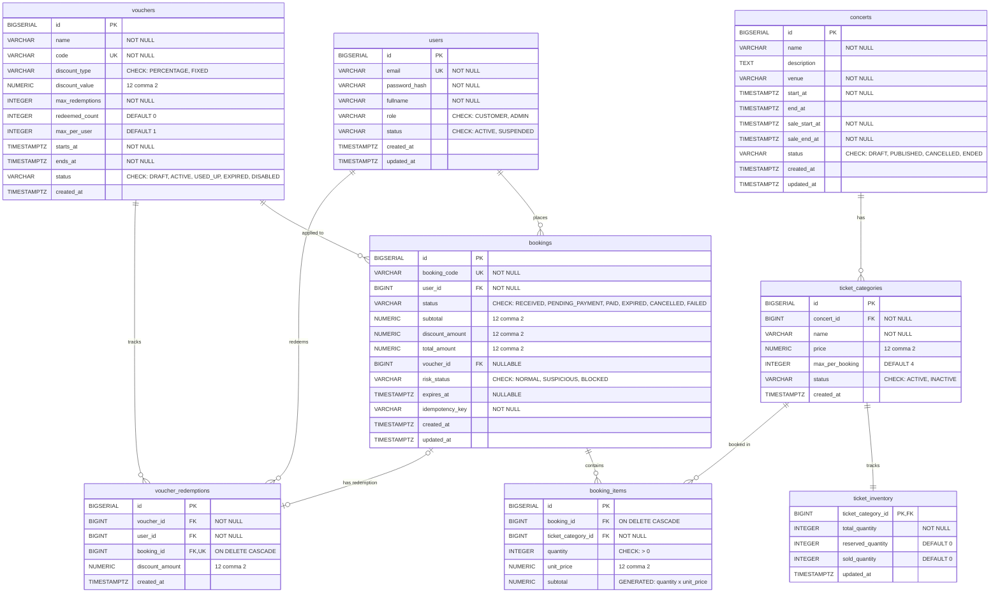
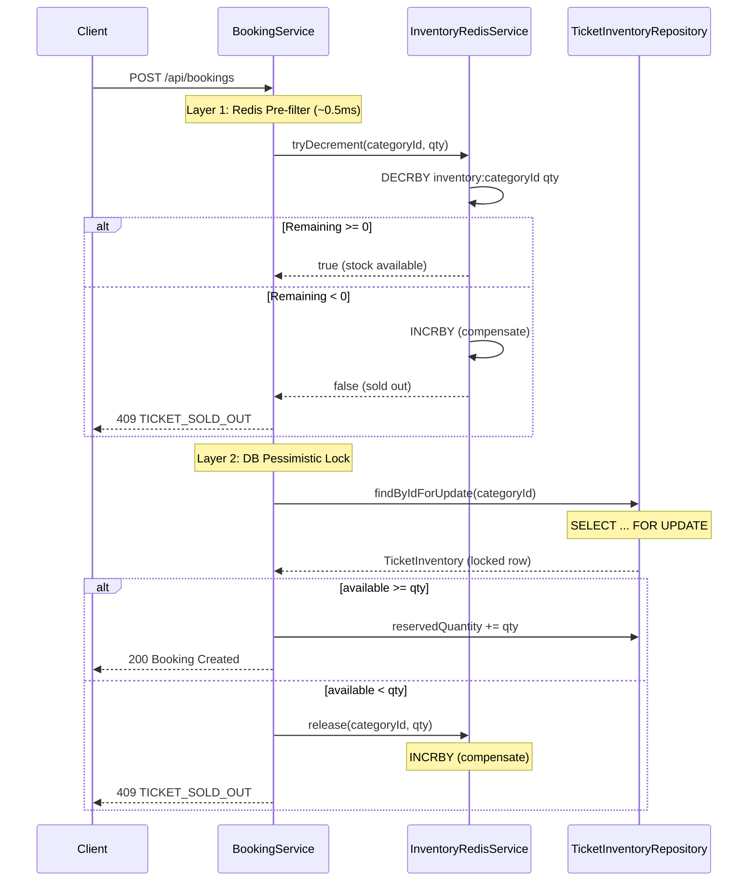
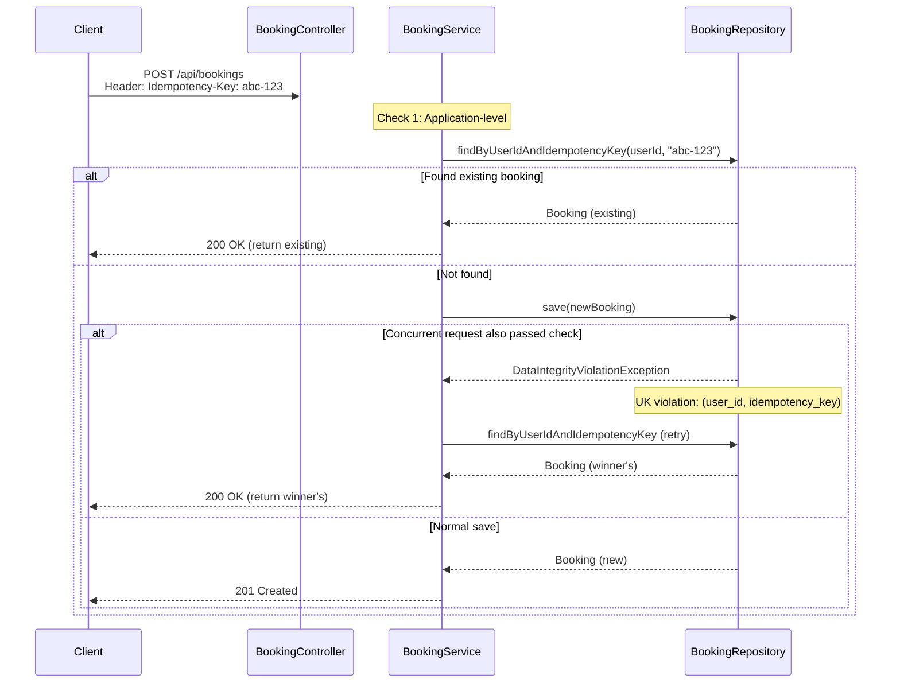
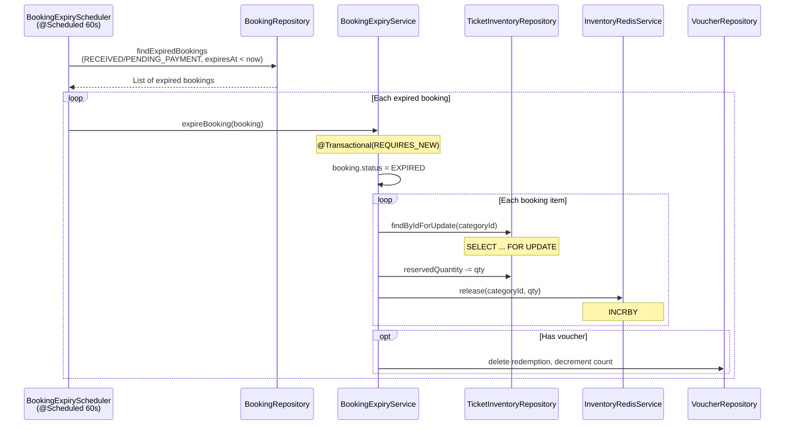

# Thiết Kế Hệ Thống & Cơ Sở Dữ Liệu

> Tài liệu phân tích kiến trúc hệ thống Concert Ticket Booking Platform, thiết kế database,
> và đặc biệt là cơ chế giải quyết bài toán Flash Sale high-concurrency.

---

## Mục Lục

- [1. Kiến Trúc Tổng Thể (System Architecture)](#1-kiến-trúc-tổng-thể-system-architecture)
- [2. Luồng Xử Lý Request (Request Pipeline)](#2-luồng-xử-lý-request-request-pipeline)
- [3. Thiết Kế Database](#3-thiết-kế-database)
- [4. API Endpoints](#4-api-endpoints)
- [5. Phân Tích Giải Pháp Flash Sale](#5-phân-tích-giải-pháp-flash-sale)
- [6. Cấu Hình Hiệu Năng](#6-cấu-hình-hiệu-năng)

---

## 1. Kiến Trúc Tổng Thể (System Architecture)

Hệ thống được xây dựng theo kiến trúc **Modular Monolith** — tất cả các module nghiệp vụ chạy trong cùng một JVM process, nhưng được tổ chức thành các package độc lập với boundary rõ ràng.

### Tổng Quan Các Thành Phần



### Mô Tả Các Module

| Module | Trách nhiệm | Class chính |
|---|---|---|
| `auth/` | Đăng ký, đăng nhập, phát JWT token | `AuthController`, `AuthService` |
| `booking/` | Vòng đời booking: tạo, xác nhận thanh toán, hết hạn | `BookingController`, `BookingService`, `BookingExpiryService`, `BookingExpiryScheduler` |
| `catalog/` | Duyệt concert & loại vé (public API) | `ConcertController`, `ConcertService`, `TicketCategoryService` |
| `common/` | Cross-cutting: response format, exception, cache config, rate limit | `ApiResponse`, `ErrorCode`, `GlobalExceptionHandler`, `RateLimitFilter`, `CacheConfig` |
| `inventory/` | Quản lý tồn kho real-time bằng Redis atomic counter | `InventoryRedisService` |
| `operation/` | Admin dashboard: quản lý concert, booking, voucher | `OperationService`, `OperationBookingController`, `OperationConcertController`, `OperationVoucherController` |
| `security/` | JWT filter, Spring Security configuration | `JwtAuthFilter`, `JwtService`, `SecurityConfig` |
| `user/` | User entity, role management | `User` (implements `UserDetails`), `Role` enum |
| `voucher/` | Voucher validation, redemption, chống lạm dụng | `VoucherService`, `Voucher`, `VoucherRedemption` |

### 1.3. Quyết Định Thiết Kế Kiến Trúc (Architecture Decision Record - ADR)

> **Bối cảnh quyết định (Context)**:  
> Trước khi bắt tay vào triển khai mã nguồn, đội ngũ kỹ thuật đối mặt với bài toán thiết kế hệ thống bán vé Flash Sale cho sự kiện Concert ra mắt với kỳ vọng **50,000 người dùng** và **Lưu lượng đỉnh 300 – 500 yêu cầu đặt vé / phút**. Doanh nghiệp đặt ra **4 mối lo ngại sống còn**: *(1) Bán âm vé (Overselling)*, *(2) Đặt trùng đơn do retry*, *(3) Lạm dụng mã giảm giá*, và *(4) Mất ổn định hệ thống khi sốc tải*.
>
> **Quyết định (Decision)**:  
> Lựa chọn mô hình kiến trúc **Modular Monolith (Package-by-Feature)** kết hợp cơ chế kiểm soát đồng thời 2 tầng (**Two-Tier Concurrency Control: Redis Pre-filter + Database Pessimistic Lock**).

---

#### 🎯 1. Phân Tích & Đối Chiếu Các Phương Án Kiến Trúc Ban Đầu

Tại giai đoạn thiết kế ban đầu (Design Phase), 3 phương án kiến trúc chính đã được đưa lên bàn cân:

```
Phương án A: Microservices                 ──► ❌ Quá tải hạ tầng, rủi ro mất toàn vẹn dữ liệu Flash Sale
Phương án B: Traditional Layered Monolith  ──► ❌ Rác mã nguồn, khớp nối chặt, khó bảo trì dài hạn
Phương án C: Modular Monolith (ĐƯỢC CHỌN) ──► ✅ Điểm cân bằng hoàn hảo: ACID mạnh + Code sạch + Tinh gọn + Phát triển nhanh
```

| Tiêu chí đánh giá | Phương án A: Microservices | Phương án B: Traditional Monolith | Phương án C: Modular Monolith (Được chọn) |
|---|---|---|---|
| **Độ toàn vẹn dữ liệu (Data Integrity)** | 🔴 Thấp (Phụ thuộc Eventual Consistency & Saga) | 🟢 Cao (Dùng chung DB Transaction) | 🟢 **Rất Cao (DB ACID Transaction + Lock nội bộ)** |
| **Độ trễ xử lý (Latency Budget)** | 🔴 Cao (Tốn 20-50ms qua nhiều chặng mạng) | 🟢 Rất thấp (In-process memory call) | 🟢 **Siêu thấp (< 5ms, In-memory Java call)** |
| **Khả năng chống Overselling** | 🔴 Khó (Dễ race condition giữa các service) | 🟡 Trung bình (Dễ bị nghẽn DB nếu không có Redis) | 🟢 **Tuyệt đối (Redis Pre-filter + DB Row Lock)** |
| **Tính module hóa & Code sạch** | 🟢 Rất cao (Tách repo/service riêng) | 🔴 Kém (Spaghetti code, tầng nọ đè tầng kia) | 🟢 **Rất cao (Ranh giới Package-by-Feature rõ ràng)** |
| **Chi phí hạ tầng & Vận hành** | 🔴 Đắt đỏ ($500 - $2,000/tháng cho cụm K8s) | 🟢 Rẻ ($20 - $40/tháng cho 1 VPS) | 🟢 **Tối ưu ($20 - $40/tháng cho 1 VPS/Container)** |
| **Tốc độ phát triển (Time-to-Market)** | 🔴 Chậm (70% thời gian dựng hạ tầng) | 🟢 Nhanh | 🟢 **Rất nhanh (Tập trung 100% vào nghiệp vụ lõi)** |

---

#### 🛡 2. Luận Cứ Thiết Kế: Giải Quyết 4 Nỗi Lo Cốt Lõi Của Doanh Nghiệp

Dựa trên phân tích kỹ thuật trước khi xây dựng hệ thống, Modular Monolith mang lại các đảm bảo lý thuyết (Theoretical Guarantees) vững chắc nhất cho 4 bài toán của startup:

1. **Bảo đảm Không Bán Âm Vé (Zero Overselling Guarantee)**:
   * Trừ tồn kho vé và tạo đơn đặt vé cần được bọc trong **1 Transaction ACID duy nhất**. Trong Modular Monolith, Spring Data JPA có thể dễ dàng quản lý giao dịch này với `@Transactional` và khóa dòng bi quan `SELECT FOR UPDATE` trên PostgreSQL.
   * *Nếu chọn Microservices*: Việc chia tách Database của Inventory và Booking sẽ phá vỡ tính nguyên tử (Atomicity). Khi hàng nghìn request ập vào, độ trễ phân tán (Network Lag) của Message Queue trong mô hình Saga sẽ không thể ngăn được tình trạng bán lố vé trước khi có sự kiện bù (compensating event).

2. **Chống Trùng Đơn Do Mạng Lag / Retry (Idempotency Enforcement)**:
   * Việc kiểm tra `Idempotency-Key` và ràng buộc cơ sở dữ liệu `UNIQUE (user_id, idempotency_key)` được thực thi trực tiếp, nguyên tử ngay tại thời điểm ghi nhận đơn hàng.
   * *Nếu chọn Microservices*: Buộc phải duy trì cụm Distributed Lock phân tán (như Redlock) qua mạng, làm tăng gấp đôi độ phức tạp và tiềm ẩn nguy cơ timeout giả mạo.

3. **Chống Lạm Dụng Mã Giảm Giá & Đua Lệnh (Voucher Abuse Prevention)**:
   * Khóa dòng bi quan trên mã voucher (`SELECT vouchers FOR UPDATE`) và ghi nhận lịch sử đổi mã `UNIQUE (voucher_id, user_id)` được thực thi đồng bộ trong cùng một transaction với đơn hàng.
   * Ngăn chặn tuyệt đối tình huống một người dùng mở nhiều tab hoặc chạy script gửi song song 10 request trong cùng 1 mili-giây để nhân bản voucher giảm giá.

4. **Bảo Đảm Tính Ổn Định Dưới Áp Lực Sốc Tải (Zero Inter-Service Cascading Failures)**:
   * **Không có độ trễ mạng liên dịch vụ**: Các module giao tiếp trực tiếp qua Java method calls trong bộ nhớ RAM ($\approx 0.0001\text{ ms}$), không phát sinh chi phí đóng gói JSON và gọi qua giao thức mạng HTTP/gRPC.
   * **Loại bỏ lỗi phân tán dây chuyền**: Tránh được tình trạng một dịch vụ phụ trợ (như Voucher Service) bị treo làm cạn kiệt Thread Pool của dịch vụ chính (Booking Service).
   * **Kiểm soát tài nguyên tập trung**: Dễ dàng cấu hình Connection Pool (HikariCP, Tomcat, Lettuce) và Rate Limiting ngay tại tầng Servlet Filter.

---

#### 🚀 3. Chiến Lược Kiến Trúc Tiến Hóa (Evolutionary Architecture Strategy)

Thiết kế Modular Monolith được định hướng như bước đệm chiến lược dài hạn cho doanh nghiệp:

* **Giai đoạn khởi đầu (Launch Week — 50,000 Users, 500 RPM)**:
  * Triển khai một gói ứng dụng duy nhất (Single Deployment Unit) dạng Docker Container. Tối đa hóa tốc độ đưa sản phẩm ra thị trường và tối thiểu hóa chi phí hạ tầng.
* **Giai đoạn mở rộng trong tương lai (Scale Phase — Hàng triệu Users)**:
  * Do các module đã được cô lập hoàn toàn theo ranh giới nghiệp vụ (Boundaries) qua các package độc lập (`booking`, `catalog`, `voucher`, `inventory`), đội ngũ kỹ thuật có thể dễ dàng nhấc bất kỳ module nào ra thành Microservice độc lập mà **không phải tái cấu trúc lại logic nghiệp vụ lõi**.

---

### 1.4. Lý Do Lựa Chọn Công Nghệ (Technology Stack Rationale)

Toàn bộ các công nghệ trong dự án được lựa chọn có chủ đích ngay từ giai đoạn thiết kế ban đầu nhằm giải quyết trọn vẹn bài toán **Hiệu năng cao, Tính toàn vẹn dữ liệu và Độ ổn định**:

| Công nghệ | Vai trò trong hệ thống | Lý do lựa chọn (Design Rationale) |
|---|---|---|
| **Java 21 (LTS)** | Ngôn ngữ & Runtime | • Bản phát hành dài hạn (LTS) ổn định nhất của JVM với hiệu năng vượt trội.<br>• Thuật toán Garbage Collection (G1GC) hiện đại giúp giảm thiểu tối đa độ trễ dừng hệ thống (GC Pauses) khi lưu lượng tăng đột biến.<br>• Tính năng hiện đại (`Records`, `Pattern Matching`) giúp mã nguồn DTO bất biến, an toàn kiểu dữ liệu (Type-safe) và gọn gàng.<br>• **Virtual Threads (Project Loom)**: Siêu nhẹ (~vài trăm Bytes thay vì 1MB của Platform Thread), tự động unmount khi chờ I/O Database/Redis, giúp 1 node xử lý hàng chục ngàn kết nối I/O đồng thời mà không lo cạn kiệt RAM/Thread. |
| **Spring Boot 4.1.0** | Ứng dụng & Framework | • Hệ sinh thái Enterprise số 1 thế giới với khả năng quản lý giao dịch (`@Transactional`) trưởng thành và tin cậy tuyệt đối.<br>• Nhúng sẵn Apache Tomcat với khả năng tinh chỉnh Thread Pool linh hoạt (`threads.max = 400`, `accept-count = 200`).<br>• Tích hợp mượt mà các thành phần cốt lõi: Spring Data JPA, Spring Security (Stateless JWT), Spring Cache. |
| **PostgreSQL 17** | Cơ sở dữ liệu chính *(Source of Truth)* | • Hệ quản trị CSDL quan hệ số 1 về khả năng kiểm soát đồng thời (MVCC) và độ tuân thủ ACID nghiêm ngặt.<br>• Hỗ trợ ràng buộc CHECK phức tạp, Generated Columns (`STORED`), và Composite Unique Constraints để bảo vệ toàn vẹn dữ liệu ở tầng thấp nhất.<br>• Hỗ trợ **Partial Index (Chỉ mục có điều kiện)** giúp tối ưu hóa truy vấn quét đơn hết hạn trong sub-millisecond.<br>• Cơ chế Khóa bi quan (`SELECT ... FOR UPDATE`) tin cậy, chống triệt để race condition và bán âm vé. |
| **Redis 7** | Bộ nhớ đệm & Bộ đếm nguyên tử | • Mô hình xử lý đơn luồng nguyên tử (Single-threaded Atomic Operations): Các lệnh `DECRBY`, `INCRBY` xử lý tức thì trong RAM (~0.5ms), hoàn hảo để làm **Layer 1 Pre-filter** loại bỏ 95%+ request quá tải trước khi chạm DB.<br>• Cơ chế bền vững dữ liệu (`AOF - Append Only File`) kết hợp chính sách `noeviction` đảm bảo tồn kho vé an toàn khi khởi động lại. |
| **Caffeine Cache** | In-Memory Local Cache | • Thư viện bộ nhớ đệm nội vùng (In-Process Cache) nhanh nhất trên JVM (thuật toán Window TinyLFU).<br>• Đọc dữ liệu trực tiếp trong RAM của JVM với độ trễ nanosecond (Zero Network I/O), giảm tải tối đa cho các API đọc danh mục concert (`GET /api/concerts`) trong giờ cao điểm Flash Sale. |
| **Bucket4j** | Giới hạn tần suất *(Rate Limiting)* | • Triển khai thuật toán Token Bucket chuẩn xác, thread-safe (Lock-free Atomic CAS) với chi phí CPU cực thấp.<br>• Phân luồng cấu hình độc lập: 5 booking/phút/user (chống spam đơn) và 10 login/phút/IP (bảo vệ CPU khỏi tấn công vét cạn mật khẩu BCrypt). |
| **Flyway** | Quản lý Migration DB | • Quản lý phiên bản Schema DB qua các file Plain SQL (`V1` → `V5`), trực quan, không phụ thuộc cú pháp phức tạp.<br>• Tự động thực thi migration khi ứng dụng khởi động, bảo đảm 100% đồng nhất cấu trúc database giữa các môi trường Local, Docker, CI/CD và Staging. |
| **MapStruct 1.5.5** | Chuyển đổi DTO ↔ Entity | • Sinh code mapping lúc biên dịch (Compile-time code generation), tốc độ thực thi nhanh ngang viết tay.<br>• Hoàn toàn không dùng Java Reflection lúc runtime (như ModelMapper), giúp tiết kiệm CPU quý giá trong thời điểm Flash Sale. |
| **SpringDoc OpenAPI 3.0** | Tài liệu & Giao diện Swagger UI | • Chuẩn tài liệu API quốc tế (OpenAPI 3.0).<br>• Tự động sinh tài liệu tương tác trực quan tại `/swagger-ui.html` kèm nút Authorize JWT, giúp đối tác Frontend và QA test API dễ dàng. |
| **Testcontainers** | Kiểm thử tích hợp *(Integration Test)* | • Khởi tạo container PostgreSQL 17 thật trong Docker lúc chạy test.<br>• Đảm bảo tính chính xác 100% về hành vi SQL, Transaction Rollback, Foreign Key và Lock (khắc phục hoàn toàn nhược điểm sai lệch cú pháp khi dùng H2 in-memory database). |

---

## 2. Luồng Xử Lý Request (Request Pipeline)

### Filter Chain

Mọi HTTP request đi qua chuỗi filter theo thứ tự:

```
Client Request
    │
    ▼
┌─────────────────────────────────────┐
│  RateLimitFilter (Bucket4j)         │
│  - POST /api/bookings: 5 req/min   │
│    per user (JWT email)             │
│  - POST /api/auth/login: 10 req/min│
│    per IP                           │
│  → 429 nếu vượt limit              │
└──────────────┬──────────────────────┘
               │
               ▼
┌─────────────────────────────────────┐
│  JwtAuthFilter                      │
│  - Extract Bearer token             │
│  - Validate signature + expiry      │
│  - Load User from DB                │
│  - Set SecurityContext              │
└──────────────┬──────────────────────┘
               │
               ▼
┌─────────────────────────────────────┐
│  SecurityFilterChain                │
│  - /api/auth/** → permitAll         │
│  - GET /api/concerts/** → permitAll │
│  - /api/operation/** → ROLE_ADMIN   │
│  - anyRequest → authenticated       │
└──────────────┬──────────────────────┘
               │
               ▼
         Controller → Service → Repository → DB/Redis
```

### Tomcat Thread Pool

```yaml
server:
  tomcat:
    threads:
      max: 400          # Max concurrent request threads
      min-spare: 50     # Always-ready threads
    accept-count: 200   # Queue size when all threads busy
    connection-timeout: 3000  # 3 seconds
```

---

## 3. Thiết Kế Database

### Entity-Relationship Diagram



### Các Bảng Chính

#### `users` — Người dùng
- **PK**: `id` (BIGSERIAL)
- **UK**: `email`
- **Check constraints**: `role IN ('CUSTOMER', 'ADMIN')`, `status IN ('ACTIVE', 'SUSPENDED')`
- **Mapping**: Entity `User.java` (implements `UserDetails`)

#### `concerts` — Sự kiện / Concert
- **PK**: `id` (BIGSERIAL)
- **Check constraints**: `status IN ('DRAFT', 'PUBLISHED', 'CANCELLED', 'ENDED')`, `sale_end_at > sale_start_at`
- **Index**: `idx_concerts_status_sale_period` trên `(status, sale_start_at, sale_end_at)`
- **Mapping**: Entity `Concert.java`

#### `ticket_categories` — Loại vé
- **PK**: `id` (BIGSERIAL)
- **FK**: `concert_id → concerts(id)`
- **UK**: `(concert_id, name)` — mỗi concert không trùng tên loại vé
- **Mapping**: Entity `TicketCategory.java`

#### `ticket_inventory` — Tồn kho vé (Database layer)
- **PK/FK**: `ticket_category_id → ticket_categories(id)`
- **Check constraint**: `reserved_quantity + sold_quantity <= total_quantity`
- **Note**: Cột `version` (optimistic lock) đã bị drop ở migration V4, chuyển sang Redis-based concurrency control
- **Mapping**: Entity `TicketInventory.java`

#### `vouchers` — Mã giảm giá
- **PK**: `id` (BIGSERIAL)
- **UK**: `code`
- **Check constraints**: percentage ≤ 100, `redeemed_count <= max_redemptions`
- **Status lifecycle**: DRAFT → ACTIVE → USED_UP / DISABLED
- **Mapping**: Entity `Voucher.java`

#### `bookings` — Đơn đặt vé
- **PK**: `id` (BIGSERIAL)
- **UK**: `booking_code`, `(user_id, idempotency_key)`
- **FK**: `user_id → users(id)`, `voucher_id → vouchers(id)` (nullable)
- **Check constraint**: `total_amount = subtotal - discount_amount`
- **Indexes**: `idx_bookings_status_created_at`, `idx_bookings_user_created_at`, `idx_bookings_expires_at` (partial index)
- **Mapping**: Entity `Booking.java`

#### `booking_items` — Chi tiết vé trong đơn
- **PK**: `id` (BIGSERIAL)
- **FK**: `booking_id → bookings(id) ON DELETE CASCADE`
- **UK**: `(booking_id, ticket_category_id)`
- **Computed column**: `subtotal = quantity * unit_price` (GENERATED ALWAYS STORED)
- **Mapping**: Entity `BookingItem.java`

#### `voucher_redemptions` — Lịch sử sử dụng voucher
- **PK**: `id` (BIGSERIAL)
- **UK**: `booking_id` (one voucher per booking)
- **Unique Index**: `(voucher_id, user_id)` — mỗi user chỉ dùng 1 voucher 1 lần (DB-level enforcement)
- **FK**: `booking_id → bookings(id) ON DELETE CASCADE`
- **Mapping**: Entity `VoucherRedemption.java`

### Flyway Migrations

| Version | File | Mô tả |
|---|---|---|
| V1 | `V1__init_schema_database.sql` | Tạo 8 bảng, indexes, constraints |
| V2 | `V2__update_user_roles.sql` | Đổi role `USER` → `CUSTOMER`, cập nhật check constraint |
| V3 | `V3__insert_sample_data.sql` | Seed data: 3 users, 3 concerts, 9 ticket categories, 3 vouchers |
| V4 | `V4__drop_inventory_version.sql` | Bỏ cột `version` khỏi `ticket_inventory` (chuyển sang Redis) |
| V5 | `V5__add_voucher_updated_at.sql` | Thêm cột `updated_at` vào bảng `vouchers` phục vụ JPA Auditing |

---

## 4. API Endpoints

### Public Endpoints (Không cần xác thực)

| Method | Endpoint | Mô tả |
|---|---|---|
| `POST` | `/api/auth/register` | Đăng ký tài khoản (mặc định role CUSTOMER) |
| `POST` | `/api/auth/login` | Đăng nhập, nhận JWT token |
| `GET` | `/api/concerts` | Danh sách concerts đã published |
| `GET` | `/api/concerts/{id}` | Chi tiết concert |
| `GET` | `/api/concerts/{id}/ticket-categories` | Loại vé + số lượng available (real-time từ Redis) |

### Customer Endpoints (Yêu cầu JWT, role: CUSTOMER)

| Method | Endpoint | Mô tả |
|---|---|---|
| `POST` | `/api/bookings` | Tạo booking (yêu cầu header `Idempotency-Key`) |
| `GET` | `/api/bookings` | Xem danh sách bookings của user |
| `GET` | `/api/bookings/{id}` | Chi tiết booking |
| `POST` | `/api/bookings/{id}/confirm-payment` | Xác nhận thanh toán |

### Admin Endpoints (Yêu cầu JWT, role: ADMIN, prefix `/api/operation/`)

| Method | Endpoint | Mô tả |
|---|---|---|
| `POST` | `/api/operation/concerts` | Tạo concert mới (status: DRAFT) |
| `PATCH` | `/api/operation/concerts/{id}/publish` | Publish concert |
| `POST` | `/api/operation/concerts/{id}/ticket-categories` | Thêm loại vé |
| `POST` | `/api/operation/concerts/{id}/ticket-categories/{catId}/inventory` | Thiết lập tồn kho |
| `GET` | `/api/operation/bookings` | Xem tất cả bookings |
| `PATCH` | `/api/operation/bookings/{id}/status` | Cập nhật trạng thái booking |
| `POST` | `/api/operation/bookings/{id}/cancel` | Hủy booking + hoàn kho |
| `POST` | `/api/operation/vouchers` | Tạo voucher campaign |
| `PATCH` | `/api/operation/vouchers/{id}/disable` | Vô hiệu hóa voucher |
| `PATCH` | `/api/operation/vouchers/{id}/enable` | Kích hoạt lại voucher |

---

## 5. Phân Tích Giải Pháp Flash Sale

> **Bối cảnh**: Hệ thống cần xử lý 300–500 booking requests/phút trong thời điểm Flash Sale mở bán vé concert. Các thách thức chính: **overselling** (bán lố vé), **duplicate booking** (đặt trùng), **voucher abuse** (lạm dụng mã giảm giá), và **system stability** (ổn định hệ thống).

### 5.1. Two-Tier Inventory Control — Chống Overselling

Đây là cơ chế quan trọng nhất. Hệ thống sử dụng **hai lớp bảo vệ** để đảm bảo không bán lố vé ngay cả dưới tải concurrent cao:



#### Layer 1: Redis Atomic Pre-filter
- **Class**: [`InventoryRedisService.tryDecrement()`](../src/main/java/com/geekup/eventticketbookingservice/inventory/InventoryRedisService.java)
- **Cơ chế**: Sử dụng lệnh Redis `DECRBY` (atomic operation, ~0.5ms latency)
- **Key pattern**: `inventory:<ticketCategoryId>`
- **Logic**:
  1. `DECRBY key quantity` → nhận lại giá trị `remaining`
  2. Nếu `remaining >= 0` → stock available, cho phép tiếp tục
  3. Nếu `remaining < 0` → stock hết, thực hiện `INCRBY key quantity` (compensating rollback), trả `false`
- **Graceful degradation**: Nếu Redis unavailable hoặc key chưa tồn tại → trả `true` để fallback xuống DB
- **Pre-warming**: Redis counter được khởi tạo khi admin set inventory (`OperationService.setInventory()`) gọi `inventoryRedisService.preWarm(categoryId, available)`

**Trade-off**: Redis pre-filter loại bỏ ~95% request không hợp lệ trước khi chạm DB, giảm đáng kể áp lực lên PostgreSQL. Tuy nhiên, giữa lúc `DECRBY` và `INCRBY` (compensate), tồn tại một khoảng thời gian ngắn mà counter có thể âm — điều này chấp nhận được vì DB layer sẽ xác nhận cuối cùng.

#### Layer 2: PostgreSQL Pessimistic Write Lock
- **Class**: [`TicketInventoryRepository.findByIdForUpdate()`](../src/main/java/com/geekup/eventticketbookingservice/catalog/TicketInventoryRepository.java)
- **Cơ chế**: `@Lock(LockModeType.PESSIMISTIC_WRITE)` → SQL `SELECT ... FOR UPDATE`
- **Logic**:
  1. Acquire row-level lock trên record `ticket_inventory`
  2. Tính `available = totalQuantity - reservedQuantity - soldQuantity`
  3. Validate `available >= requestedQuantity`
  4. Increment `reservedQuantity += quantity`
  5. Commit → release lock
- **Đây là nguồn dữ liệu chính xác tuyệt đối** (source of truth). Dù Redis có sai số nhỏ, DB layer đảm bảo tính toàn vẹn.

#### Compensating Redis Rollback khi Lỗi
- **Class**: [`BookingService.createBooking()`](../src/main/java/com/geekup/eventticketbookingservice/booking/BookingService.java)
- Tất cả Redis deductions được track trong list `redisDeductedItems`
- Nếu bất kỳ bước nào fail (DB validation, voucher error, etc.), catch block sẽ iterate qua list và gọi `inventoryRedisService.release()` cho từng item
- Đảm bảo Redis counter luôn đồng bộ với trạng thái thực tế

---

### 5.2. Idempotency — Chống Duplicate Booking



#### Dual-layer Protection
1. **Application check**: `bookingRepository.findByUserIdAndIdempotencyKey()` — kiểm tra trước khi tạo booking
2. **Database constraint**: Unique constraint `uq_bookings_user_idempotency` trên `(user_id, idempotency_key)` — bắt `DataIntegrityViolationException` nếu hai request race nhau

**Trade-off**: Client phải tự generate `Idempotency-Key` (thường là UUID) và gửi qua HTTP header. Đây là pattern chuẩn của payment/booking systems (ví dụ: Stripe). Server không generate key để tránh mất key khi network timeout.

---

### 5.3. Rate Limiting — Kiểm Soát Tốc Độ Request

- **Class**: [`RateLimitFilter`](../src/main/java/com/geekup/eventticketbookingservice/common/ratelimit/RateLimitFilter.java)
- **Algorithm**: Token Bucket (Bucket4j)
- **Storage**: `ConcurrentHashMap<String, Bucket>` — in-memory, per JVM instance

| Endpoint | Limit | Key | Mô tả |
|---|---|---|---|
| `POST /api/bookings` | 5 req/min | User email (from JWT) | Chặn user spam booking |
| `POST /api/auth/login` | 10 req/min | Client IP | Chống brute-force |

- Khi vượt limit: HTTP `429 Too Many Requests` + header `Retry-After: 60`
- Response body:
```json
{
  "success": false,
  "error": {
    "code": "RATE_LIMIT_EXCEEDED",
    "message": "Too many requests, please try again later"
  }
}
```

**Trade-off**: Rate limiter lưu in-memory → không share giữa các instance. Trong multi-instance deployment, user có thể vượt limit bằng cách request vào các instance khác nhau. Giải pháp production: dùng Redis-backed rate limiter.

---

### 5.4. Voucher Abuse Prevention — Chống Lạm Dụng Voucher

- **Class**: [`VoucherService.validateAndLock()`](../src/main/java/com/geekup/eventticketbookingservice/voucher/VoucherService.java)

#### Các Lớp Bảo Vệ

| Lớp | Cơ chế | Class / Constraint |
|---|---|---|
| **Row Lock** | `@Lock(PESSIMISTIC_WRITE)` trên `VoucherRepository.findByCodeForUpdate()` | `SELECT vouchers ... FOR UPDATE` |
| **Global Usage Limit** | `redeemedCount < maxRedemptions` (check trong transaction) | `Voucher.redeemedCount` |
| **Per-User Limit** | `existsByVoucherIdAndUserId()` check | `VoucherRedemptionRepository` |
| **DB Unique Index** | `(voucher_id, user_id)` unique index | `uq_voucher_redemptions_voucher_user` |
| **Temporal Validity** | `startsAt <= now <= endsAt` | `VoucherService.validateAndLock()` |
| **Status Check** | `status == ACTIVE` | `VoucherService.validateAndLock()` |

#### Luồng Apply Voucher (trong `BookingService.createBooking`)
1. Acquire pessimistic lock trên voucher row: `findByCodeForUpdate(code)` → `SELECT ... FOR UPDATE`
2. Validate: status active, chưa hết hạn, chưa đạt max redemptions, user chưa dùng
3. Tính discount: `PERCENTAGE` → `subtotal * value / 100`, `FIXED` → `min(value, subtotal)`
4. Increment `redeemedCount`, nếu đạt max → chuyển status sang `USED_UP`
5. Tạo `VoucherRedemption` record

#### Compensation khi Booking Bị Hủy/Hết Hạn
- `BookingExpiryService.expireBooking()` hoặc `OperationService.cancelBookingAndReleaseInventory()`:
  1. Delete `VoucherRedemption` record
  2. Decrement `voucher.redeemedCount`
  3. Nếu status đang `USED_UP` → revert về `ACTIVE`

---

### 5.5. Booking Expiration — Tự Động Thu Hồi Tài Nguyên



- **Scheduler**: [`BookingExpiryScheduler`](../src/main/java/com/geekup/eventticketbookingservice/booking/BookingExpiryScheduler.java) — `@Scheduled(fixedDelay = 60_000)`
- **Service**: [`BookingExpiryService.expireBooking()`](../src/main/java/com/geekup/eventticketbookingservice/booking/BookingExpiryService.java) — `@Transactional(propagation = REQUIRES_NEW)`
- **TTL**: 15 phút (hardcoded `ZonedDateTime.now().plusMinutes(15)`)
- **Isolation**: Mỗi booking expire trong transaction riêng → nếu 1 booking fail, các booking khác không bị ảnh hưởng
- **Tài nguyên được release**: DB `reservedQuantity`, Redis counter, voucher redemption

---

### 5.6. Tổng Hợp Cơ Chế Bảo Vệ

| Threat | Protection Layer | Class/Component |
|---|---|---|
| **Overselling** | Redis `DECRBY` + DB `FOR UPDATE` | `InventoryRedisService` + `TicketInventoryRepository` |
| **Duplicate Booking** | Idempotency-Key header + DB unique constraint | `BookingController` + `BookingRepository` |
| **Request Flooding** | Token bucket rate limiter | `RateLimitFilter` (Bucket4j) |
| **Voucher Double-Use** | Pessimistic lock + per-user check + DB unique index | `VoucherService` + `VoucherRedemptionRepository` |
| **Stale Reservations** | 15-min TTL + scheduler reclamation | `BookingExpiryScheduler` + `BookingExpiryService` |
| **DB Overload** | Caffeine cache cho reads + Redis pre-filter cho writes | `CacheConfig` + `InventoryRedisService` |

---

## 6. Cấu Hình Hiệu Năng

### Connection Pool & Threading

| Component | Parameter | Value | Mục đích |
|---|---|---|---|
| **HikariCP** | `maximum-pool-size` | 30 | Max DB connections |
| | `minimum-idle` | 10 | Always-ready connections |
| | `connection-timeout` | 3000ms | Fail fast if pool exhausted |
| **Tomcat** | `threads.max` | 400 | Max concurrent request handlers |
| | `threads.min-spare` | 50 | Always-ready threads |
| | `accept-count` | 200 | OS-level queue when threads full |
| **Redis Lettuce** | `pool.max-active` | 20 | Max Redis connections |
| | `pool.min-idle` | 5 | Always-ready Redis connections |
| | `timeout` | 500ms | Redis operation timeout |
| **Hibernate** | `batch_size` | 20 | Batch INSERT/UPDATE for efficiency |
| | `order_inserts` | true | Batch insert ordering |

### Caching Strategy

| Cache Name | Provider | TTL | Max Size | Mục đích |
|---|---|---|---|---|
| `concerts` | Caffeine | 5 min | 100 | Danh sách concerts published |
| `concert` | Caffeine | 5 min | 200 | Chi tiết từng concert |
| `ticketCategories` | Caffeine | 2 min | 500 | Loại vé theo concert (với available qty từ Redis) |
| `inventory:*` | Redis | No TTL | — | Atomic stock counter per category |

**Cache Invalidation**: Trigger bởi admin operations:
- `ConcertService.evictConcertCache()` — khi publish concert
- `TicketCategoryService.evictCategoryCache()` — khi modify inventory

